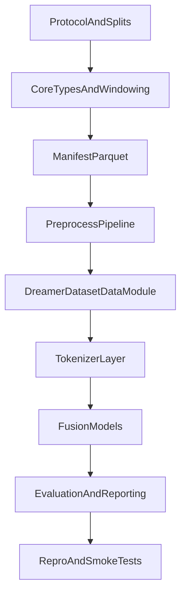

# DREAMER可扩展架构执行计划

## 目标与默认原则
- 目标：从当前 `mat_io` MVP 进化到可长期迭代的实验平台（split协议 + 预处理 + 多模态 + tokenization + 多模型）。
- 默认原则：
  - 单一职责：`source` 只读原始数据，`preprocess` 只做变换，`dataset/datamodule` 只做采样与batch，`model` 只关心张量语义。
  - manifest-first：所有训练样本先落到统一索引（Parquet），训练过程只依赖索引。
  - 配置驱动：协议/预处理/模态组合全部进 Hydra 配置，避免硬编码。
  - 每个“大步”都有可运行验收点（smoke test + 小规模训练）。

## 阶段1：冻结实验协议与目录骨架（先定规则）

### 大步1.1 定义实验协议（subject-dependent / independent）
- 小步
  - 定义统一术语：`subject_dependent`、`subject_independent`、`fold_id`、`seed`。
  - 定义切分粒度：优先按 `subject` 切分（防泄漏），dependent 允许 subject 内 trial/window 切分。
  - 定义标签任务协议：先固定 `valence/arousal/dominance` 的回归任务（后续再扩分类阈值版）。
  - 输出协议文档：新增 `[docs/experiments/dreamer_protocol.md](/home/zhang/Documents/ts_lightning/docs/experiments/dreamer_protocol.md)`。
- 验收
  - 所有人可根据文档唯一复现 split（同 seed 同结果）。

### 大步1.2 创建数据层分层目录
- 小步
  - 新建 core 层：`[src/data_pipeline/core/](/home/zhang/Documents/ts_lightning/src/data_pipeline/core/)`。
  - 新建 dreamer 适配层：`[src/data_pipeline/dreamer/](/home/zhang/Documents/ts_lightning/src/data_pipeline/dreamer/)`（保留现有 `mat_io.py`，逐步迁移）。
  - 新建预处理层：`[src/data_pipeline/preprocessing/](/home/zhang/Documents/ts_lightning/src/data_pipeline/preprocessing/)`。
  - 新建实验配置组：`[configs/dreamer/](/home/zhang/Documents/ts_lightning/configs/dreamer/)`。
- 验收
  - `main.py` 不改业务逻辑时，仓库结构已支持后续增量开发。

## 阶段2：抽象核心类型与可复用窗口器（解耦Dreamer细节）

### 大步2.1 核心类型统一
- 小步
  - 在 `[src/data_pipeline/core/types.py](/home/zhang/Documents/ts_lightning/src/data_pipeline/core/types.py)` 定义 dataclass：`TrialLabels`、`TrialSignals`、`WindowSpec`、`WindowMeta`、`WindowSample`。
  - 将 dict 返回逐步替换为类型对象（先在新代码用，旧接口兼容一段时间）。
- 验收
  - IDE/类型检查可直接提示字段，不再靠字符串 key。

### 大步2.2 抽离窗口对齐逻辑
- 小步
  - 将当前 `mat_io.py` 的 LCM tick 对齐逻辑抽到 `[src/data_pipeline/core/windowing.py](/home/zhang/Documents/ts_lightning/src/data_pipeline/core/windowing.py)`。
  - 提供纯函数：`count_windows(...)`、`locate_window(...)`，输入采样率/长度/spec，输出索引。
  - 给纯函数写单元测试（边界：长度不足、最后一个窗口、stride非整秒）。
- 验收
  - DREAMER 与未来其他数据源可共用同一窗口器。

## 阶段3：manifest-first 数据索引（你提到的 parquet 映射表）

### 大步3.1 先做 window-level Parquet 映射表
- 小步
  - 建立 manifest schema（每行=一个 window）：`sid/trial_id/window_id/split/fold_id/start_sec/end_sec/eeg_idx/ecg_idx/labels/spec_version`。
  - 在 `[src/data_pipeline/core/manifest.py](/home/zhang/Documents/ts_lightning/src/data_pipeline/core/manifest.py)` 实现构建器。
  - 在 `[src/data_pipeline/core/splits.py](/home/zhang/Documents/ts_lightning/src/data_pipeline/core/splits.py)` 实现 split 生成（dependent/independent）。
  - 输出 parquet 到 `[data/dreamer/processed/manifests/](/home/zhang/Documents/ts_lightning/data/dreamer/processed/manifests/)`。
- 验收
  - 给定配置可稳定生成同名 manifest（含 hash/spec_version）。

### 大步3.2 增加 manifest 质量检查
- 小步
  - 写检查脚本：无重复主键 `(sid, trial_id, window_id, fold_id)`。
  - 校验 split 互斥且覆盖率正确。
  - 抽样回查 `mat_io`，验证索引窗口与标签一致。
- 验收
  - 通过检查才允许进入训练。

## 阶段4：预处理插件化（先最小闭环，再扩算法）

### 大步4.1 定义预处理接口与流水线
- 小步
  - 在 `[src/data_pipeline/preprocessing/base.py](/home/zhang/Documents/ts_lightning/src/data_pipeline/preprocessing/base.py)` 定义 `Transform` 接口（`fit/transform`）。
  - 在 `[src/data_pipeline/preprocessing/pipeline.py](/home/zhang/Documents/ts_lightning/src/data_pipeline/preprocessing/pipeline.py)` 组合多个 transform。
  - 约束：`fit` 只在 train split；val/test 仅 `transform`。
- 验收
  - 同一 pipeline 可作用 EEG/ECG，不泄漏验证/测试统计量。

### 大步4.2 先实现3个基础变换（MVP）
- 小步
  - `zscore`（按通道）。
  - `detrend` 或简单去均值。
  - 可选 bandpass/notch 占位实现（先做开关，不追求最优参数）。
  - 将变换参数持久化到 `[data/dreamer/processed/artifacts/](/home/zhang/Documents/ts_lightning/data/dreamer/processed/artifacts/)`。
- 验收
  - 预处理开关可通过 Hydra 配置切换。

## 阶段5：Dataset/DataModule 重构（承接实验协议）

### 大步5.1 基于manifest实现Dataset
- 小步
  - 新增 `[src/data_pipeline/dreamer/dataset.py](/home/zhang/Documents/ts_lightning/src/data_pipeline/dreamer/dataset.py)`：`__len__` 读 manifest 行数，`__getitem__` 按行回源切窗+预处理。
  - 输出结构固定为 `{"inputs": {...}, "targets": ..., "meta": ...}`，便于模型无缝替换。
- 验收
  - 单 batch 能拿到 EEG+ECG+label+meta，且形状稳定。

### 大步5.2 新建DreamerDataModule并接入main
- 小步
  - 新增 `[src/data_pipeline/dreamer/datamodule.py](/home/zhang/Documents/ts_lightning/src/data_pipeline/dreamer/datamodule.py)`。
  - `prepare_data()` 只做 manifest/缓存准备；`setup(stage)` 只实例化 dataset。
  - 在 `[main.py](/home/zhang/Documents/ts_lightning/main.py)` 引入 dataset factory：按 `cfg.dataset.dataset_name` 选择 toy 或 dreamer datamodule。
- 验收
  - `trainer.fit` 可直接跑 dreamer 小样本 smoke test。

## 阶段6：多模态与tokenization扩展点（先接口后模型）

### 大步6.1 统一模型输入契约
- 小步
  - 新建 `[src/models/io_contracts.py](/home/zhang/Documents/ts_lightning/src/models/io_contracts.py)` 定义输入键：`eeg`, `ecg`, `mask`, `meta`。
  - 在 collate_fn 统一对齐时长、padding、mask 规则。
- 验收
  - 不同模型只需遵循同一 batch 契约。

### 大步6.2 tokenization 模块化
- 小步
  - 新建 `[src/models/tokenizers/](/home/zhang/Documents/ts_lightning/src/models/tokenizers/)`，先放 `IdentityTokenizer`（直通）和一个简单 patch tokenizer。
  - tokenizer 配置化：窗口长度、patch size、stride、模态共享/独立 tokenizer。
- 验收
  - 不改 datamodule 即可切换 tokenizer。

### 大步6.3 多模态融合策略可插拔
- 小步
  - 先实现 2 个融合骨架：early fusion（concat）和 late fusion（双塔+融合头）。
  - 将融合策略放进配置组 `[configs/dreamer/model/fusion/](/home/zhang/Documents/ts_lightning/configs/dreamer/model/fusion/)`。
- 验收
  - 同一训练脚本可切换融合策略并输出可比指标。

## 阶段7：实验编排、评估与复现

### 大步7.1 Hydra配置标准化
- 小步
  - 建立配置组：`dataset/`, `split/`, `preprocess/`, `tokenizer/`, `model/`, `train/`, `trainer/`, `logging/`。
  - 每组提供 default + 至少一个替代配置（例如 independent/dependent）。
- 验收
  - 命令行 override 一次只改一件事，实验可追踪。

### 大步7.2 评估与汇总
- 小步
  - 增加指标：MAE/MSE（回归）+ 分subject统计。
  - 保存逐样本预测（带 sid/trial/window），便于误差分析。
  - 提供 run-level 汇总脚本输出到 `[outputs/](/home/zhang/Documents/ts_lightning/outputs/)`。
- 验收
  - independent/dependent 两类实验都有统一报告。

### 大步7.3 复现与CI最小保障
- 小步
  - 固定随机种子、deterministic 配置。
  - 增加最小测试集：windowing单测、manifest校验、datamodule smoke。
  - 增加最小训练冒烟（1 epoch, 小batch）。
- 验收
  - 新增预处理/模型不应破坏基本训练链路。

## 推荐执行节奏（避免一次做太大）
- Sprint A（1周）：阶段1-3（协议 + core + manifest）。
- Sprint B（1周）：阶段4-5（预处理MVP + datamodule接入）。
- Sprint C（1-2周）：阶段6-7（tokenization/融合 + 评估编排）。

## 里程碑依赖图

## 第一批立刻可开工的小步（今天就能做）
- 写 `dreamer_protocol.md`（先冻结 split 和任务定义）。
- 设计并定稿 manifest schema（字段名与类型）。
- 抽离 `windowing.py` 纯函数并补单测。
- 产出第一版 manifest parquet（先不加复杂预处理）。
- 用 manifest 驱动最小 `DreamerDataset` 跑一个 dataloader batch。