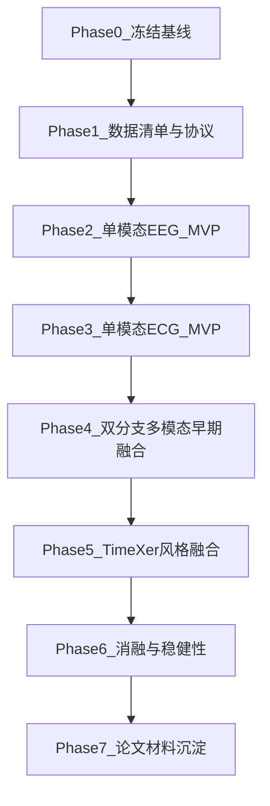

# EEG+ECG 情绪识别分步计划（从舒适区到论文）

## 当前起点（已确认）
- 训练入口已经稳定：[`/home/zhang/Documents/multimodal_balance/main.py`](/home/zhang/Documents/multimodal_balance/main.py)
- 最小模型可跑：[`/home/zhang/Documents/multimodal_balance/src/ts_toy_classification/models/toy_classification_module.py`](/home/zhang/Documents/multimodal_balance/src/ts_toy_classification/models/toy_classification_module.py)
- DataModule 是最小假数据版：[`/home/zhang/Documents/multimodal_balance/src/ts_toy_classification/data_pipeline/datamodule.py`](/home/zhang/Documents/multimodal_balance/src/ts_toy_classification/data_pipeline/datamodule.py)
- 你希望直接走公开 EEG+ECG 多模态路线，且有 5090D 单卡算力。

## 总策略
- 采用“受控拿来主义”：只迁移 TimeXer 的 backbone 思路和关键参数，不搬整套训练脚手架。
- 先保留你现有 Lightning + Hydra 训练框架，逐步替换数据与模型。
- 每一步都定义“通过标准”，避免连续多改导致定位困难。

## Phase 0（半天）：冻结可复现实验骨架
- 目标：先确保“训练流程、日志、配置”三件套可复现。
- 小步：
  - 保持当前 toy 流程能稳定运行并保存日志。
  - 在配置里新增一个 `seed`（统一随机性控制）。
  - 明确输出目录结构（log/checkpoint/metrics）。
- 通过标准：同一配置重复跑 2 次，指标波动可解释。

## Phase 1（1-2天）：多模态数据准备与协议先行
- 目标：选定 1 个公开 EEG+ECG 情绪数据集作为主线数据。
- 小步：
  - 建立 `data_manifest`（被试、模态、标签、采样率、时长、缺失情况）。
  - 定义统一窗口方案（例如窗口长度、滑窗步长、是否重叠）。
  - 定义被试级划分协议（train/val/test 按 subject）。
  - 先写“数据检查脚本”只做统计，不做训练。
- 通过标准：输出一份可审计的数据摘要（每类样本数、每被试样本数、模态缺失率）。

## Phase 2（1-2天）：EEG 单模态 MVP
- 目标：在真实数据上完成第一个可训练可验证闭环。
- 小步：
  - DataModule 从假数据切到真实 EEG 读取。
  - 模型先保留轻量分类头（暂不引入复杂融合）。
  - 增加 `val_loss`、`macro_f1`、`accuracy` 记录。
  - 添加早停与 best checkpoint 保存。
- 通过标准：`val_macro_f1` 明显高于随机基线，且训练不崩。

## Phase 3（1天）：ECG 单模态 MVP
- 目标：验证 ECG 分支独立有效，避免后续融合“盲调”。
- 小步：
  - 复用 Phase 2 流程，只替换输入模态为 ECG。
  - 统一同一划分协议与指标定义。
  - 记录 EEG-only vs ECG-only 对比表。
- 通过标准：两条单模态曲线均可稳定收敛。

## Phase 4（1-2天）：双分支早期融合基线
- 目标：先建立简单且稳定的多模态 baseline。
- 小步：
  - 建立双输入 DataModule（EEG, ECG, label）。
  - 双分支编码后 `concat + MLP head` 融合。
  - 增加模态缺失保护（若某模态为空则跳过样本或掩码）。
- 通过标准：多模态结果不低于最佳单模态。

## Phase 5（2-4天）：接入 TimeXer 风格 backbone
- 目标：将你的 baseline 升级为“可写进论文方法部分”的模型。
- 小步：
  - 从 TimeXer 源码迁移关键编码块到你项目模型目录（只迁移必要模块）。
  - 先在单模态替换验证，再放入双分支融合。
  - 对齐关键超参组（embedding维度、层数、dropout、lr、wd）。
- 通过标准：TimeXer 风格模型在至少一个设置上优于 early fusion baseline。

## Phase 6（2-3天）：论文级消融与稳健性
- 目标：让结果“可解释且可说服”。
- 小步：
  - 消融 1：去掉 ECG，仅 EEG。
  - 消融 2：去掉 EEG，仅 ECG。
  - 消融 3：TimeXer 替换为轻量 backbone。
  - 稳健性：3 个随机种子重复，给出均值±方差。
- 通过标准：给出一页清晰对比表和关键结论。

## Phase 7（1-2天）：论文材料沉淀
- 目标：形成可投稿的实验叙事骨架。
- 小步：
  - 整理方法图（数据流 + 模型流）。
  - 输出主结果表、消融表、训练曲线图。
  - 固化“复现实验命令清单”。
- 通过标准：别人按你的 README 能复现主实验流程。

## 与现有代码对接（首批会改动的关键文件）
- 训练入口沿用：[`/home/zhang/Documents/multimodal_balance/main.py`](/home/zhang/Documents/multimodal_balance/main.py)
- DataModule 逐步替换：[`/home/zhang/Documents/multimodal_balance/src/ts_toy_classification/data_pipeline/datamodule.py`](/home/zhang/Documents/multimodal_balance/src/ts_toy_classification/data_pipeline/datamodule.py)
- 模型逐步替换：[`/home/zhang/Documents/multimodal_balance/src/ts_toy_classification/models/toy_classification_module.py`](/home/zhang/Documents/multimodal_balance/src/ts_toy_classification/models/toy_classification_module.py)
- 配置扩展起点：[`/home/zhang/Documents/multimodal_balance/configs/ts_toy_classification/config.yaml`](/home/zhang/Documents/multimodal_balance/configs/ts_toy_classification/config.yaml)

## 执行节奏（舒适区版本）
- 每天只推进 1 个最小闭环：
  - 上午：实现 1 个小改动。
  - 下午：跑 1 次训练 + 记录 1 条结论。
  - 晚上：只做复盘，不叠加新改动。
- 规则：没拿到“通过标准”就不进入下一 Phase。